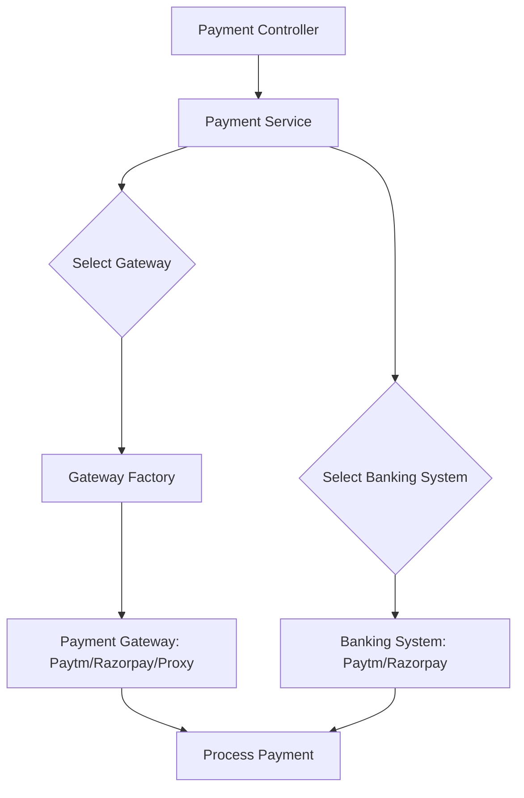

# Payment Gateway LLD

## Overview
This project implements a Low-Level Design (LLD) for a Payment Gateway system in C++. It demonstrates the use of design patterns such as Factory, Strategy, and Proxy to create a flexible, extensible, and testable payment processing architecture. The system supports multiple payment gateways (e.g., Paytm, Razorpay) and banking systems, allowing easy integration and extension.

---

## Architecture

### 1. Core Components

#### a. Payment Request
- **File:** Payment_Request.h
- **Role:** Encapsulates all details required for a payment (amount, payer, payee, etc.).

#### b. Payment Controller
- **File:** Payment_Controller.h
- **Role:** Entry point for payment requests. Orchestrates the payment process by interacting with the Payment Service.

#### c. Payment Service
- **File:** Payment_Service.h
- **Role:** Contains business logic for processing payments. Selects the appropriate payment gateway and banking system using the Factory and Strategy patterns.

#### d. Gateway Factory
- **File:** Gateway_Factory.h
- **Role:** Responsible for creating instances of payment gateways based on input (e.g., "Paytm", "Razorpay").

---

### 2. Gateway Strategies
- **Folder:** Gateway_Strategies/
- **Files:**
  - Payment_Gateway.h (Base interface)
  - Paytm_Gateway.h
  - Razorpay_Gateway.h
  - Proxy_Gateway.h
- **Role:**
  - Each gateway implements the `Payment_Gateway` interface.
  - `Proxy_Gateway` can be used to add cross-cutting concerns (e.g., logging, throttling) without modifying gateway code.

---

### 3. Banking Strategies
- **Folder:** Banking_Strategies/
- **Files:**
  - Banking_System.h (Base interface)
  - Paytm_Banking_System.h
  - Razorpay_Banking_System.h
- **Role:**
  - Each banking system implements the `Banking_System` interface.
  - Allows the payment service to interact with different banks in a uniform way.

---

## Design Patterns Used

- **Factory Pattern:**
  - Used in `Gateway_Factory` to instantiate the correct payment gateway at runtime.
- **Strategy Pattern:**
  - Used for both payment gateways and banking systems, allowing dynamic selection and easy extension.
- **Proxy Pattern:**
  - Used in `Proxy_Gateway` to add additional behavior (e.g., logging, security) around gateway calls.

---

## Flow Diagram

---

## How to Extend
- **Add a new Payment Gateway:**
  1. Implement the `Payment_Gateway` interface in a new file.
  2. Register it in `Gateway_Factory`.
- **Add a new Banking System:**
  1. Implement the `Banking_System` interface in a new file.
  2. Update the payment service to support the new system.

---

## Example Usage
See `Main.cpp` for a sample usage of the payment gateway system.

---

## Output
- All outputs (logs, results) are stored in the `output/` directory.

---

## License
This project is for educational purposes.
